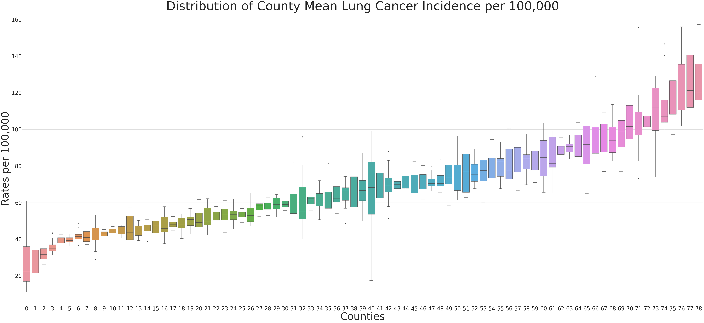

# Predicting Lung Cancer Rates in Select U.S. Counties
My Galvanize Capstone Project

Motivation:
Cancer is one of the leading causes of death both in the U.S. and worldwide, and lung cancer is one of the most widespread and deadly varieties. Much research has been done on the link between smoking tobacco and lung cancer risk; it is estimated that ~85% of lung cancer cases are attributed to smoking tobacco. The remaining 10-15% is not as well understood (but a very significant portion given how prevalent lung cancer is). Air pollution, as well as exposure to various chemicals (radon, asbestos, arsenic, cadmium, etc.) explain many of the remaining lung cancer cases.

Recently there has been increased focus on considering the interplay between many different health and environmental factors when determining risk for chronic diseases. For example, a heavy smoker exposed to bad air pollution is significantly more at risk for lung cancer than a heavy smoker not exposed to bad air pollution or a nonsmoker exposed to bad air pollution. By looking at a wide variety of the known variables related to lung cancer, one might be able to better predict the number of to-be diagnosed lung cancer cases per year at a local level (county-wide), providing healthcare professionals and policymakers with actionable insights (catching lung cancer early drastically increases chances of survival).

Data Sources: Refer to data_dictionary.txt

## Figure 1: Distribution of countywide age and gender standardized lung cancer incidence per 100,00 between 2000-2013
