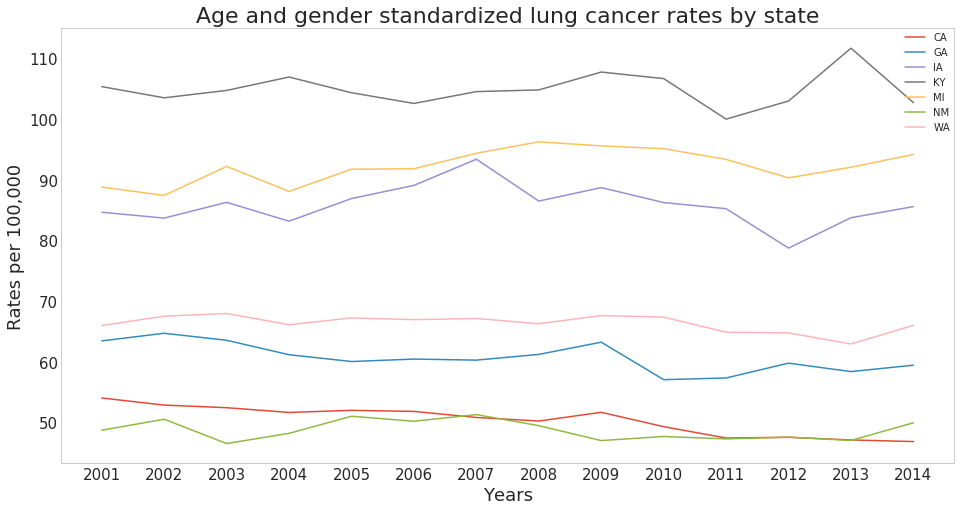
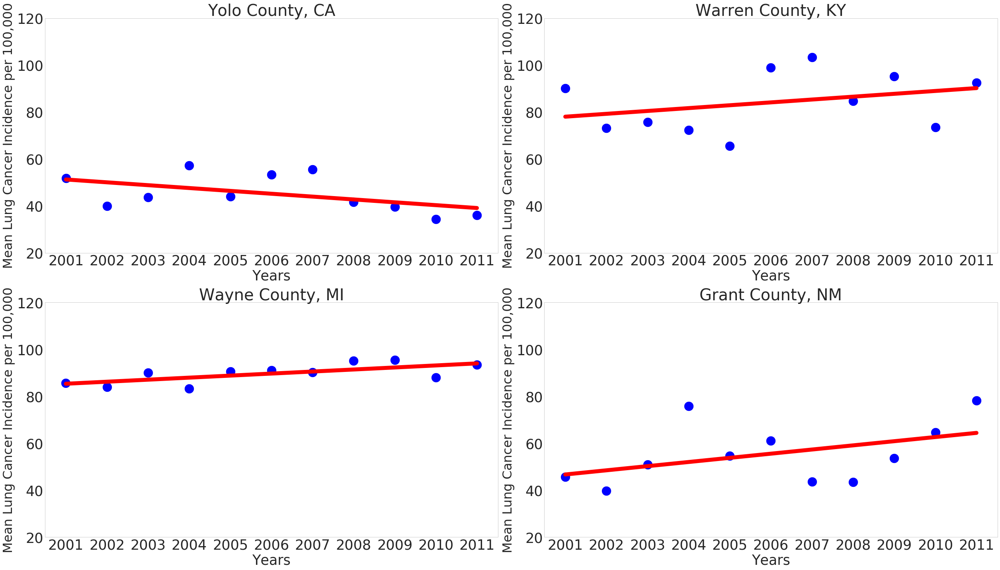
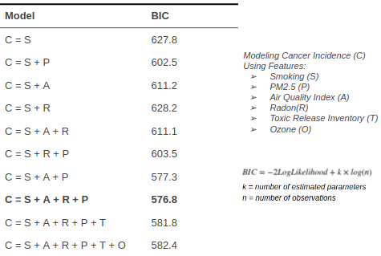
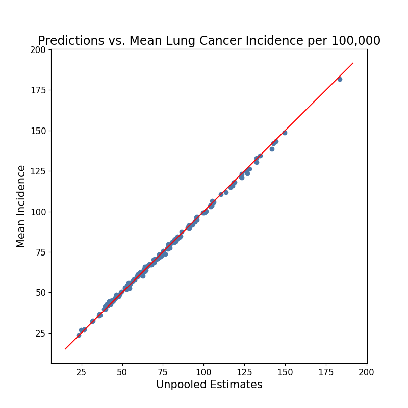
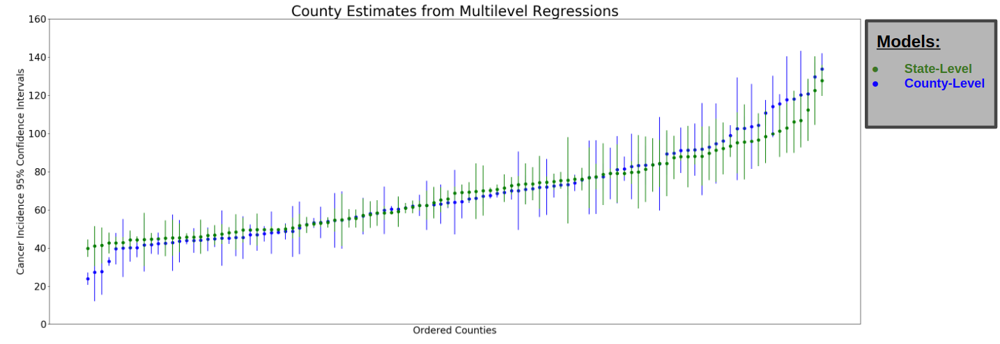

# Predicting Lung Cancer Rates in Select U.S. Counties
My Galvanize Capstone Project

## ***Motivation***
Cancer is one of the leading causes of death both in the U.S. and worldwide, and lung cancer is one of the most widespread and deadly varieties. Much research has been done on the link between smoking tobacco and lung cancer risk; it is estimated that ~85% of lung cancer cases are attributed to smoking tobacco. The remaining 10-15% is not as well understood (but a very significant portion given how prevalent lung cancer is). Air pollution, as well as exposure to various chemicals (radon, asbestos, arsenic, cadmium, etc.) explain many of the remaining lung cancer cases.

Recently there has been increased focus on considering the interplay between many different health and environmental factors when determining risk for chronic diseases. For example, a heavy smoker exposed to bad air pollution is significantly more at risk for lung cancer than a heavy smoker not exposed to bad air pollution or a nonsmoker exposed to bad air pollution. By looking at a wide variety of the known variables related to lung cancer, one might be able to better predict the number of to-be diagnosed lung cancer cases per year at a local level (county-wide), providing healthcare professionals and policymakers with actionable insights (catching lung cancer early drastically increases chances of survival).

### Figure 1: Distribution of countywide age and gender standardized lung cancer incidence per 100,000 between 2001-2011

It is evident that counties differ drastically in their risk for lung cancer - counties in Kentucky show incidence of 150 per 100,00, while counties in California hover around 30 per 100,000, a 5-fold difference.

### Figure 2: State-wide mean lung cancer incidence per 100,000 between 2001-2011

Not only do individual counties differ drastically from each other, but states also display substantial differences in mean lung cancer incidence.

## ***Least Squares Fitting***

### Figure 3: Mean lung cancer incidence per 100,000 for select counties between 2001-2011

These individual linear best fit lines look pretty good. Linear modeling should produce good results.

Although the least squares lines look like they do a good job of explaining incidence over time in different counties, they are surely overfitting and the predictions generated from such a model would not generalize to other counties/future years.

## ***Data Sources***

I requested research access to the NIH SEER Cancer Data, which comprises both cancer incidence and population data for several U.S. states from 1973-2014. I also found public county-wide data on adult smoking levels, radon levels, PM 2.5 levels, ozone levels, toxic releases and air quality index values. For this analysis I limited my time horizon to 2001-2011 due to the best data availability during this period. The full list of data sources used can be found in data_dictionary.txt

### ***Cleaning & Standardization***

A considerable amount of time was spent cleaning and grouping the SEER data so that it could be joined with the other data sources mentioned above.

The only county-wide smoking data I could find were age and gender standardized (according to U.S. census methodogy) so that adult smoking percentages can be compared among counties without looking at the role that gender and age play in determining risk for lung cancer. I decided to use this same methodology to compute age and gender standardized lung cancer incidence figures per 100,000, using age groups <65 and 65+. More detailed explanations of my methodology can be found in methods.txt

## ***Feature Selection***

When deciding which of the features to include in my models, I compared the Bayesian Information Criteria (BIC) scores of various Lasso regressions that I ran, each including a different set of predictors:

### Table 1: Comparing feature sets using BIC scores

The BIC score is able to help deal with the overfitting problem mentioned previously. The first component of the BIC, called the likelihood function, is a measure of goodness of fit between a model and the data. The more features you include in your model, the lower your likelihood function will be (the lower the better). The second component of BIC is the regularization parameter. This term penalizes models by the number of features included. So models containing extra features that don't add much information will show higher scores (worse).

The model which minimizes the BIC is comprised of features:
* Adult Daily Smoking % Estimates
* Days of Harmful PM 2.5
* Air Quality Index Levels
* Mean Radon Levels

## ***Simple Linear Regression***

Without introducing a hierarchical struture to the data, we have 3 options:
1. Fully-Pooled: Model 2001-2011 lung cancer incidence through use of a single regression model for all counties
2. State-Pooled: Model 2001-2011 lung cancer incidence through use of separate regression models for each state
3. Unpooled: Model 2001-2011 lung cancer incidence by running separate regression models on each individual county

I tried both fully-pooled and unpooled models, and chose to evaluate model performance on Root Mean Square Error (RMSE), a measure of the standard deviation of model predictions from actual values:

A lower RMSE value is desired. The fully-pooled model had an RMSE of 18.6, and the unpooled an RMSE of 10.3. Relative to the mean lung cancer incidence of ~70 for all counties, the unpooled model wasn't bad. But clearly the fully-pooled model is not a good option.

### Figure 4: Unpooled estimates vs. actual mean lung cancer incidence per county

This plot shows that the unpooled model does a very good job of estimating the mean incidence per county. But how good is it at generalizing to future years or to other counties? Probably not great. Both counties and states share many similarites that would explain lung cancer incidence that I have not included in my model, such as smoking prevention initiatives and air quality standards. These confounding variables could be very useful when forecasting county-wide incidence, but the unpooled model does not take them into account. Therefore, in order to improve upon these baseline models, I chose to try two different multilevel regression models which help control for these confounding variables.

## ***Multilevel Regression***

