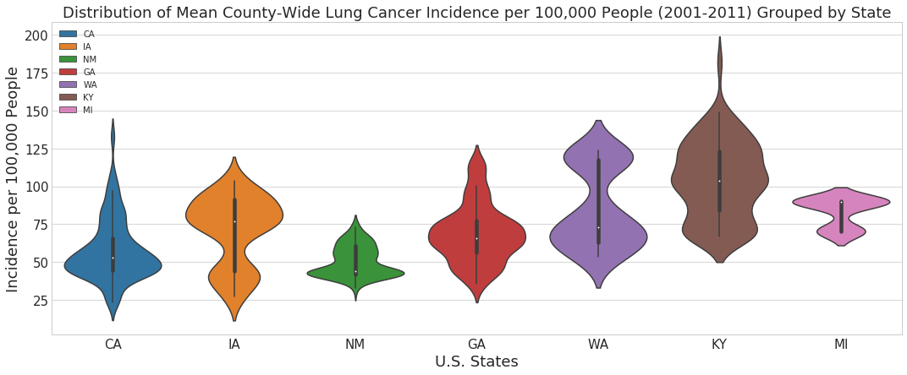
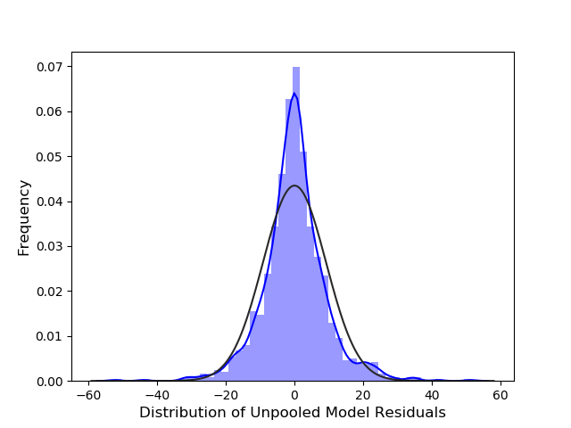

# Modeling Lung Cancer Incidence in Select U.S. Counties
My Galvanize Capstone Project

A special thanks to [ZNA Health](http://www.znahealth.com/) for helping me formulate my ideas for this project and for guiding me towards important data sources and research.

## ***Index***

* [Motivation](#motivation)
* [Data Sources](#data-sources)
* [Cleaning and Standardization](#cleaning-and-standardization)
* [Feature Selection](#feature-selection)
* [Primary Assumptions Behind Linear Regression](#primary-assumptions-behind-linear-regression)
* [Simple Linear Regression](#simple-linear-regression)
* [Multilevel Modeling](#multilevel-modeling)
* [Multilevel Modeling - Difference Between Models](#multilevel-modeling---difference-between-models)
* [Multilevel Modeling - Details](#multilevel-modeling---details)
* [Future Direction](#future-direction)

## ***Motivation***
Cancer is one of the leading causes of death both in the U.S. and worldwide, and lung cancer is one of the most widespread and deadly varieties. Much research has been done on the link between smoking tobacco and lung cancer risk; it is estimated that ~85% of lung cancer cases are attributed to smoking tobacco. The remaining 10-15% is not as well understood (but a very significant portion given how prevalent lung cancer is). Air pollution, as well as exposure to various chemicals (radon, asbestos, arsenic, cadmium, etc.) explain many of the remaining lung cancer cases.

Recently there has been increased focus on considering the interplay between many different health and environmental factors when determining risk for chronic diseases. For example, a heavy smoker exposed to bad air pollution is significantly more at risk for lung cancer than a heavy smoker not exposed to bad air pollution or a nonsmoker exposed to bad air pollution. By looking at a wide variety of the known variables related to lung cancer, one might be able to better predict the number of to-be diagnosed lung cancer cases per year at a local level (county-wide), providing healthcare professionals and policymakers with actionable insights (catching lung cancer early drastically increases chances of survival).

### Figure 1: Distribution of County-wide Age and Gender Standardized Lung Cancer Incidence per 100,000 People Between 2001-2011

It is evident that counties differ drastically in their risk for lung cancer - counties in Kentucky show incidence of 150 per 100,00, while counties in California hover around 30 per 100,000, a **5-fold difference.**

### Figure 2: State-wide Mean Lung Cancer Incidence per 100,000 People Between 2001-2011

Not only do individual counties differ drastically from each other, but counties in different states also display substantial differences in mean lung cancer incidence.

## ***Data Sources***

I requested research access to the NIH SEER Cancer Data, which comprises both cancer incidence and population data for several U.S. states from 1973-2014. I also found public county-wide data on adult smoking levels, radon levels, PM 2.5 levels, ozone levels, toxic releases and air quality index values. For this analysis I limited my time horizon to 2001-2011 due to the best data availability during this period. The full list of data sources used can be found in [data_dictionary.txt](https://github.com/dhense177/Modeling_Lung_Cancer_Risk/blob/master/data_dictionary.txt)

## ***Cleaning and Standardization***

A considerable amount of time was spent cleaning and grouping the SEER data so that it could be joined with the other data sources mentioned above.

The only county-wide smoking data I could find were age and gender standardized (according to U.S. census methodology) so that adult smoking percentages can be compared among counties without looking at the role that gender and age play in determining smoking behavior. I decided to use this same methodology to compute age and gender standardized lung cancer incidence figures per 100,000 people, using age groups <65 and 65+. More detailed explanations of my methodology can be found in [methods.txt](https://github.com/dhense177/Modeling_Lung_Cancer_Risk/blob/master/methods.txt)

## ***Feature Selection***

A question you may be asking yourself - why not just use all the features we have to try to estimate county-wide incidence rates?

The problem with this approach is that features which do not actually relate to lung cancer incidence will be adding "noise" to the model. This noise will be used by the model in making predictions, but they would not generalize to other counties or future years. This is commonly referred to as overfitting.

So we need to find the features which relate most to lung cancer incidence and drop redundant features or those which don't provide very much information.

When deciding which features to include in my models, I compared the Bayesian Information Criteria (BIC) and Akaike Information Criteria (AIC) scores of various Lasso regressions that I ran, each including a different set of predictors:

### Table 1: Comparing Feature Sets Using BIC Scores

The BIC and AIC are very similar, except BIC penalizes extra parameters more harshly. Let's focus on the BIC.

The first component of the BIC, called the likelihood function, is a measure of goodness of fit between a model and the data. The more features you include in your model, the higher your likelihood function will be (the higher the better). The second component of BIC is the regularization parameter. This term penalizes models by the number of features included. So models containing extra features that don't add much information will show higher scores (worse).

The model which minimizes the BIC and AIC is comprised of features:
* Adult Daily Smoking % Estimates
* Days of Harmful PM 2.5 Levels
* Air Quality Index Levels
* Log Mean Radon Levels

## ***Primary Assumptions Behind Linear Regression***

* **Assumption 1: Sample Data Representative of Population**

Here it would be wise to consider what population we can infer from our sample counties. All U.S. Counties? Probably not. The data in this analysis is limited - we only have cancer data on counties in 7 states. Also, the health and environmental data I gathered tends to be more available in larger counties (>100,000 people). Therefore, it would make more sense to say that the relevant population is large U.S. counties or only large counties in the 7 states in the data (and maybe similar states).

* **Assumption 2: True Relationship Between X and Y is Linear**

### Figure 3: Mean Lung Cancer Incidence per 100,000 for Select Counties Between 2001-2011

The predictions in red come from my baseline unpooled regression model (discussed in detail in the [next section](#simple-linear-regression)), and seem to closely resemble the linear best fit line.

It is safe to say that the relationship between our variables and lung cancer incidence appears linear.

* **Assumption 3: Features are Linearly Independent**

### Figure 4: Heatmap Showing Correlations Among Features and Target

There does not seem to be any serious collinearity between features that we should worry about. The correlations between radon and smoking (0.27) and Median AQI and smoking (-0.23) are the largest in absolute terms among the set of variables.

One interesting finding is that there appears to be a negative correlation between Median Air Quality Index values and lung cancer incidence in these counties. This certainly warrants further investigation.

Daily smoking is the most correlated feature with lung cancer incidence while log mean radon levels and days of high PM2.5 seem to be adding some information as well.

* **Assumption 4: Residuals are Independent and Normally Distributed**

### Figure 5: Distribution of Residuals with Q-Q Plot

The residuals from my baseline unpooled regression model look approximately normal.

* **Assumption 5: Variance of Residuals is Constant (Homoscedasticity)**

### Figure 6: Variance of Residuals from Unpooled Model

The variance of the residuals is almost exactly constant, except for prediction values >100, where our data is more sparse.

Now that these assumptions behind linear regression seem to hold up, we can dive into the modeling.

## ***Simple Linear Regression***

Without introducing a hierarchical structure to the data, we have 3 options:
1. Fully-Pooled: Model 2001-2011 lung cancer incidence through use of a single regression model for all counties
2. State-Pooled: Model 2001-2011 lung cancer incidence through use of separate regression models for each state
3. Unpooled: Model 2001-2011 lung cancer incidence by running separate regression models on each individual county

I tried both fully-pooled and unpooled models, and chose to evaluate model performance on Root Mean Square Error (RMSE), a measure of the standard deviation of model predictions from actual values:

A lower RMSE value is desired. The fully-pooled model had an RMSE of **17.5**, and the unpooled an RMSE of **9.2**. Relative to the mean lung cancer incidence of ~70 for all counties, the unpooled model wasn't bad. Clearly the fully-pooled model is not a good option.

But I think we can do better.

Both counties and states share many similarities that would explain lung cancer incidence that I have not included in my models, such as smoking prevention initiatives and air quality standards. These confounding variables could be very useful when forecasting county-wide incidence, but the unpooled model does not take them into account. Therefore, in order to improve upon these baseline models, I chose to focus on multilevel regression which helps incorporate this useful information by assuming underlying similarities between counties.

## ***Multilevel Modeling***

Multilevel, or hierarchical regression techniques are a compromise between the pooled and unpooled methods. This approach assumes that while the coefficients (y-intercept, slope terms) are different for each county, they all come from a common group distribution ("prior").

This type of parameter estimation is core to Bayesian Statistics. While
frequentist methods assume that model coefficients are always fixed, Bayesian methods try to estimate the coefficients. I will discuss the details of this estimation in a [following section](#multilevel-modeling---details).

I tried 2 multilevel models, differing by the group distributions specified. The first uses state-level grouping, so that the population distribution for each county comprises all counties in the same state. The second model uses a population distribution comprising all 105 counties in the data.

### Table 2: Linear Model Comparison

Overall I obtained the best results by estimating model coefficients using a group distribution comprising all counties without state-level grouping.

## ***Multilevel Modeling - Difference Between Models***

Lets take a look at Warren County, KY to get a better sense for the difference between the 2 multilevel models I tried:

### Figure 7: Yearly Point Estimates and 95% Confidence Intervals from Multilevel Models in Warren County Kentucky

Kentucky counties have the highest lung cancer incidence out of all states in my data. The statewide average is ~100 per 100,000. Even though Warren County seems to show significantly lower mean incidence ~80-85, the dark green line is shifted upwards towards the Kentucky group mean. The dark blue line, however, fits the local data very well and seems less influenced by the overall mean for all counties (~70 per 100,000).

Looking at plots of a few other counties:

### Figure 8: Yearly Point Estimates and 95% Confidence Intervals from Multilevel Models in Four Counties

It is easy to see that the county-level model produces point estimates and 95% confidence intervals that fit the data much better than the state-grouped model.

Looking at the point estimates and 95% confidence intervals for mean incidence rates across all counties:

### Figure 9: Point Estimates and 95% Confidence Intervals of Mean Incidence from Multilevel Models in All Counties

An important point to note is that the Bayesian 95% confidence intervals displayed in the above graphs can correctly be interpreted as containing 95% of the true incidence values unlike standard frequentist intervals. This is one of the major advantages of Bayesian modeling.

### ***Caveat***

Since I was limited by data availability for many of the variables I used, there are some states with very few counties in my data. For example, I only have data on 3 counties in Michigan, even though there are 83 in the state. Using the state-level hierarchical model, counties in these states are highly influenced by only a few other counties in the same state, which may be why this model underperforms the baseline unpooled model.

## ***Multilevel Modeling - Details***

Since our results show a significant improvement over non-hierarchical methods, let's take a deeper look into the multilevel modeling approach.

We are fitting separate regressions for each county and trying to estimate model parameters so as to avoid overfitting produced by our unpooled model. Our multilevel estimates of county lung cancer incidence incorporate similarities between all U.S. counties in the data, and should generalize much better to other similar counties.

The estimation process is accomplished using the Markov Chain Monte Carlo (MCMC) algorithm. MCMC is gaining popularity in epidemiology where complex modeling is common, and can be a drastic improvement over traditional maximum likelihood estimation techniques.

MCMC is a stochastic procedure which repeatedly draws random samples from the dataset which characterize the distribution of parameters of interest.
* Markov Chain: Generates random samples from dataset. Directed random walk (sampling of parameter values proportional to their probabilities) through parameter space which describes all possible values for parameters of interest
* Monte Carlo: Generates summary statistics from random samples

### Figure 10: PyMC3 Traceplot

PyMC3 is a Probabilistic Programming library in python which I used for this analysis. The left column of the traceplot above shows the distributions for population mean model parameters (blue) and the distributions of individual model parameters (multi-colored) for each county. The right column shows the random walk taken through the parameter space for each of these distributions.

An interesting finding here is that distributions for both beta3 and beta4 (coefficients for variables Median AQI and log radon) are centered around a negative mean. Thinking back to the [figure 4 heatmap](https://github.com/dhense177/Modeling_Lung_Cancer_Risk/blob/master/Visuals/heatmap.png) - Median AQI did have a negative correlation with lung cancer, but log radon showed a slightly positive correlation (~5%) with lung cancer. The negative-centered beta coefficient distribution for radon may be due to the relatively high collinearity between log radon and daily smoking (27%). It would certainly be worth taking a deeper look into.

## ***Future Direction***

* Look into negative-centered beta distributions for log radon and Median AQI variables

* Combine strengths of both the state-level and county-level hierarchical models. I could try only using the state-level models on counties where there is sufficient data on other counties in the same state. I could also try using state-level grouping for certain model parameters and county-level grouping for others when calculating county-wide incidence estimates.

* I would  like to try analyzing other data related to lung cancer incidence (socioeconomic, other health factors)

* In addition to standardizing the data by age and gender, it would be helpful to standardize by race/ethnicity as well, since this is a confounding variable that explains differences in incidence rates.

* Lastly, in order to build a strong predictive model that could generalize well to other counties/years, it would be necessary to obtain unaggregated healthcare data with many more data points per county.

If you have any questions about my project please email me at dhense177@gmail.com.

## ***Sources***

A full list of data sources can be found in [data_dictionary.txt](https://github.com/dhense177/Modeling_Lung_Cancer_Risk/blob/master/data_dictionary.txt). The below sources helped tremendously with my analysis.

* [The Best Of Both Worlds: Hierarchical Linear Regression in PyMC3 (Danne Elbers, Thomas Wiecki)](http://twiecki.github.io/blog/2014/03/17/bayesian-glms-3/)

* [Multilevel (Hierarchical) Modeling:What It Can and Cannot Do (Andrew Gelman)](http://www.stat.columbia.edu/~gelman/research/published/multi2.pdf)

* [A Primer on Bayesian Methods for Multilevel Modeling](http://docs.pymc.io/notebooks/multilevel_modeling.html)

* [GLM: Model Selection](http://docs.pymc.io/notebooks/GLM-model-selection.html)

* [Bayesian inference in ecology](http://onlinelibrary.wiley.com/doi/10.1111/j.1461-0248.2004.00603.x/full)

* [Markov Chain Monte Carlo: and introduction for epidemiologists](https://www.ncbi.nlm.nih.gov/pmc/articles/PMC3619958/)

* [Cigarette smoking prevalence in US counties: 1996-2012](https://www.ncbi.nlm.nih.gov/pmc/articles/PMC3987818/)

* [Forecasting Medicare Spending at the County Level](https://github.com/brendan-drew/County-Medicare-Spending)

* [Data Sources for an Environmental Quality Index: Avaliability, Quality and Utility](https://www.ncbi.nlm.nih.gov/pmc/articles/PMC3222503/)

* [Comprehensive data exploration with Python](https://www.kaggle.com/pmarcelino/comprehensive-data-exploration-with-python)

* [Applications of Machine Learning in Cancer Prediction and Prognosis](https://www.ncbi.nlm.nih.gov/pmc/articles/PMC2675494/)
